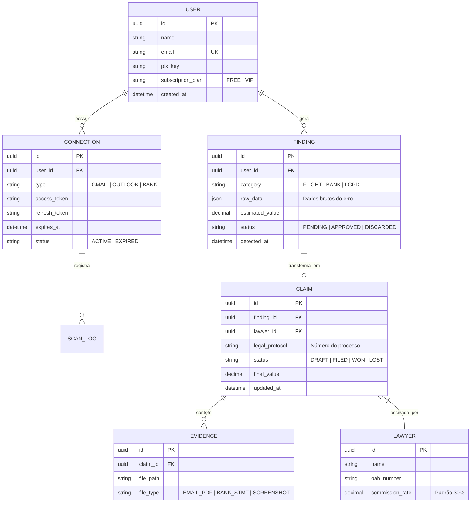

# CLAIMY - Database Schema (V1.0)

Este esquema define como os dados serão estruturados para suportar a busca automática e a gestão jurídica.

## Pontos Chave da Modelagem:
1.  **Separação entre Finding e Claim:** Nem todo erro detectado vira um processo. O usuário (ou você) aprova o `Finding` para ele virar uma `Claim`.
2.  **Criptografia:** Os campos `access_token` e `refresh_token` devem ser criptografados em nível de banco de dados (Vault).
3.  **JSON B:** O campo `raw_data` no `Finding` permite armazenar metadados flexíveis (ex: número do voo para ANAC ou nome do vazamento para LGPD).
